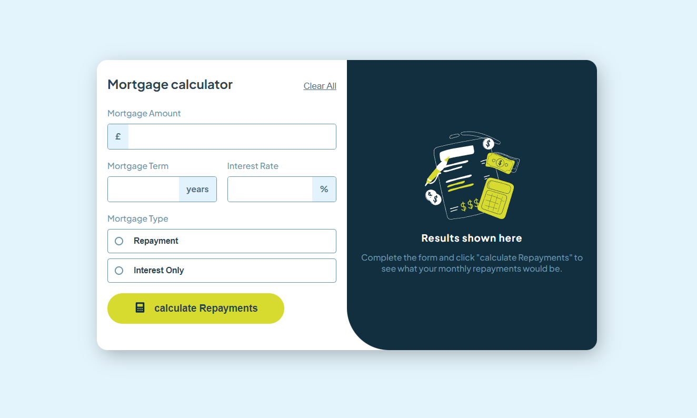

# Frontend Mentor - Mortgage repayment calculator solution

This is a solution to the [Mortgage repayment calculator challenge on Frontend Mentor](https://www.frontendmentor.io/challenges/mortgage-repayment-calculator-Galx1LXK73). Frontend Mentor challenges help you improve your coding skills by building realistic projects.

## Table of contents

- [Overview](#overview)
  - [The challenge](#the-challenge)
  - [Screenshot](#screenshot)
- [My process](#my-process)
  - [Built with](#built-with)
  - [What I learned](#what-i-learned)
  - [Continued development](#continued-development)
  - [Useful resources](#useful-resources)
- [Author](#author)
- [Acknowledgments](#acknowledgments)

## Overview

This is my third challenge that ive dont with front end mentor. I achieved this one all by myself instead of help from a course on free code camp!

### The challenge

Users should be able to:

- Input mortgage information and see monthly repayment and total repayment amounts after submitting the form
- See form validation messages if any field is incomplete
- Complete the form only using their keyboard
- View the optimal layout for the interface depending on their device's screen size
- See hover and focus states for all interactive elements on the page

### Screenshot

## My process

I did the structure first to make sure everythign is in the rigth place then worked on the styles to make it look nice. Then lastly i did the js to add functionality!

### Built with

- Semantic HTML5 markup
- CSS custom properties
- Flexbox
- CSS Grid
- Mobile-first workflow

### What I learned

Ive learned much more on how javascript can be used in projects. It has made me much more comfortable with js as well as css.

### Continued development

I would like the improve the effiecency of my code as i feel i did not write the css or js as short as possible.

I want to learn react after i am confident with the basics and learn back end webdevelopment to be able to make a full web app.

### Useful resources

- [fullstack foundations](https://www.fullstackfoundations.com/) - provided a long course on html, javascript and css

## Author

- Github - [My GitHub](https://github.com/coding-astrounaut)
- Frontend Mentor - [@yourusername](https://www.frontendmentor.io/profile/coding-astrounaut)

## Acknowledgments

free code camp and zg_dev were great by providing a 20hour + course on front end development for free. It has got me here from knowing nothing about web dev to being comfortable with the basics.

**Note: Delete this note and edit this section's content as necessary. If you completed this challenge by yourself, feel free to delete this section entirely.**
